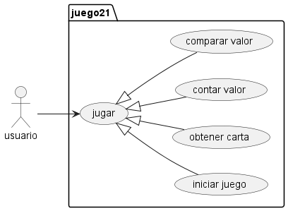
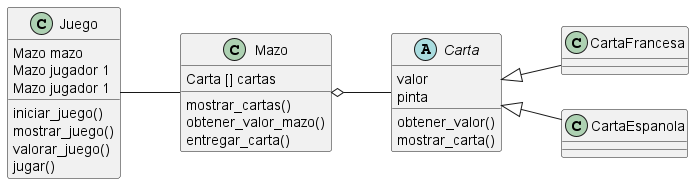

# Ventiuna 

El juego de 21 es un juego de cartas, con una o mas barajas permite a dos jugadores pedir carta hasta estar lo mas proximo al valor de 21 sin pasarse. 

En esta versión simularemos un 21 de un jugador vs. el repartidor. 

EL repartidor estara obligado a pedir cartas hasta igualar al jugador y solo se plantará cuando lo iguale o supere. 

El jugador solo pódra ganar si tiene mejor puntaje que el repartidor pero sin pasarse de 21. 

Las cartas numéricas suman su valor, las figuras como __"J, Q, K"__ suman 10 y el As vale 1 o 11 según convenga, solo puede valer 11 si con este valor no excede el valor de 21 de lo contrario solo suma 1. 

## Diagramas: 

- Diagrama de casos de uso: 
 
- Diagrama de clase: 

- Diagrama de secuencia: 